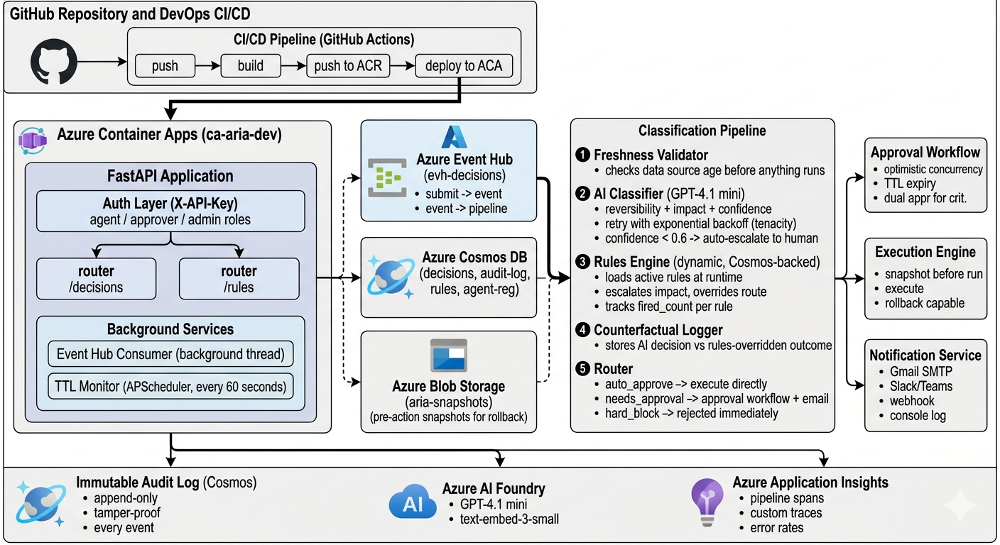

# ARIA — AI Reliability & Integrity Architecture

> **The missing accountability layer between AI agents and enterprise systems.**

[](https://ca-aria-dev.purpleisland-b4cd0839.centralus.azurecontainerapps.io/docs)
[](https://python.org)
[](https://fastapi.tiangolo.com)
[](LICENSE)

---

## The Problem

88% of enterprise AI projects never reach production — not because the model failed, but because the **system around the model** had no guardrails, no oversight, and no way to undo what went wrong.

| Company | What happened | What was missing |
|---|---|---|
| **Air Canada** | AI chatbot made refund promises that violated policy. Company paid in court. | No approval layer, no audit trail |
| **Replit** | AI agent deleted production databases during a cleanup task | No privilege boundary, no rollback |

In these two cases, the model did exactly what it was asked. The failure was in the system around it.

---

## What ARIA Does

ARIA sits between every AI agent and the real world. Before any action executes — wire transfer, document change, data deletion, mass email — ARIA intercepts it, classifies its risk, enforces business rules, routes it appropriately, and permanently logs everything.

```
AI Agent wants to do something
        ↓
ARIA intercepts it
        ↓
① Data freshness check    — is the data the AI is acting on current?
② AI classification       — reversible or not? what's the risk level?
③ Rules engine            — do org policies override the AI?
④ Route decision          — auto-approve, human approval, or hard block?
⑤ Execute with snapshot   — capture state before running, enable rollback
⑥ Immutable audit log     — every step, every actor, forever
```

**The AI does 30% of the work. The engineering does the rest.**

---

## Demo

🔗 **[Video Link] (https://youtu.be/Dy4pETMc-aQ)**

| Username | Password | Role | Access |
|---|---|---|---|
| `admin` | `aria-admin-2026` | Admin | Full access |
| `approver` | `aria-approver-2026` | Approver | Approve, reject, execute |
| `tester` | `aria-tester-2026` | Tester | Submit and read |

---

## Architecture

### System Overview



### Production Pipeline

```
┌─────────────────────────────────────────────────────────────────┐
│                        GitHub Repository                        │
│              CI/CD: push → build → ACR → deploy ACA            │
└──────────────────────────────┬──────────────────────────────────┘
                               ↓
┌─────────────────────────────────────────────────────────────────┐
│              Azure Container Apps  (ca-aria-dev)                │
│                                                                 │
│   FastAPI Application                                           │
│   ├── Auth Layer (X-API-Key: agent / approver / admin)         │
│   ├── /decisions router                                         │
│   ├── /rules router                                             │
│   ├── Event Hub Consumer (background thread)                    │
│   └── TTL Monitor (APScheduler, every 60s)                      │
└────────┬──────────────────────────────────────────────────────  ┘
         ↓ publish event
┌────────────────────┐    ┌──────────────────────────────────────┐
│  Azure Event Hub   │    │        Classification Pipeline       │
│  (evh-decisions)   │───▶│                                      │
│                    │    │  ① Freshness Validator               │
│  submit → event    │    │     checks data source age           │
│  event → pipeline  │    │                                      │
└────────────────────┘    │  ② AI Classifier  (GPT-4.1)    │
                          │     reversibility + impact           │
┌────────────────────┐    │     retry with exponential backoff   │
│  Azure Cosmos DB   │    │     confidence < 0.6 → escalate      │
│                    │◀──▶│                                      │
│  decisions         │    │  ③ Rules Engine  (Cosmos-backed)     │
│  audit-log         │    │     loads active rules at runtime    │
│  rules             │    │     escalates impact, overrides AI   │
│  agent-registry    │    │     tracks fired_count per rule      │
└────────────────────┘    │                                      │
                          │  ④ Counterfactual Logger             │
┌────────────────────┐    │     AI decision vs rules outcome     │
│  Azure Blob        │◀──▶│                                      │
│  (aria-snapshots)  │    │  ⑤ Router                           │
│                    │    │     auto_approve → execute           │
│  pre-action state  │    │     needs_approval → email + wait    │
│  for rollback      │    │     hard_block → rejected            │
└────────────────────┘    └──────────────────────────────────────┘
                                         ↓
                          ┌──────────────────────────────────────┐
                          │         Immutable Audit Log          │
                          │  Cosmos DB · append-only · every     │
                          │  event timestamped and permanent     │
                          └──────────────────────────────────────┘
```

---

## Key Features

### Decision Lifecycle — 11 States
```
submitted → validating → classified → auto_approved ──────────────┐
                                   → pending_approval → approved──┤
                                   → rejected                     ↓
                                                            executing
                                                                  ↓
                                                    completed → rolled_back
                                                    failed
```

Every state transition is logged with actor, timestamp, and reason. Terminal states are irreversible by design.

### Dynamic Rules Engine
Rules are stored in Cosmos DB and loaded fresh on every pipeline execution. No restart, no redeploy — change a rule in the UI and it fires on the next decision.

```python
# Rules support multiple condition types
{
  "condition": {
    "action_types": ["wire_transfer", "payment"],
    "payload_field": "amount",
    "operator": "gt",
    "value": 10000,
    "description_contains": "urgent"
  },
  "override": {
    "impact": "critical",
    "add_approvers": ["CFO", "Finance Manager"],
    "reason": "Large urgent transfer requires senior approval."
  }
}
```

Rules escalate only — they can never downgrade what the AI classified as high risk.

### AI Classification with Defence-in-Depth
The classifier uses GPT-4.1 but is not solely depended upon:

```
AI classifies → confidence < 0.6 → auto-escalate to human
AI classifies → rules engine overrides if business policy requires
AI classifies → fallback on failure: high impact, needs_approval (never auto-approve)
AI classifies → reversibility is the most reliable signal (binary, grounded in semantics)
```

The reversibility judgment — can this action be undone? — is the most defensible classification because it's grounded in the real-world consequence of the action, not its label.

### Optimistic Concurrency on Approvals
Simultaneous approvals are handled using Cosmos DB ETags. The second writer fails with a 409 Conflict, preventing duplicate approval race conditions.

```python
self.decisions.replace_item(
    decision_id,
    item,
    etag=current_etag,
    match_condition=MatchConditions.IfNotModified
)
```

### Rollback
Before any execution ARIA captures a JSON snapshot of pre-action state to Azure Blob Storage. If the outcome is wrong, state can be restored with one API call. Wire transfers are explicitly marked as non-rollbackable — the system knows the difference.

### At-Least-Once Processing — Handled
Event Hub guarantees at-least-once delivery. Duplicate events are handled through idempotent status checks:

```python
decision, _ = cosmos.get_decision(decision_id)
if decision.status != DecisionStatus.SUBMITTED:
    partition_context.update_checkpoint(event)
    return  # already processed — skip
```

---

## API Reference

### Decisions
| Method | Endpoint | Role | Description |
|---|---|---|---|
| `POST` | `/decisions/submit` | Agent | Submit an AI action for evaluation |
| `GET` | `/decisions/` | Approver | List decisions with filters |
| `GET` | `/decisions/{id}` | Agent | Get decision and current state |
| `GET` | `/decisions/{id}/audit` | Agent | Full immutable audit trail |
| `POST` | `/decisions/{id}/approve` | Approver | Approve a pending decision |
| `POST` | `/decisions/{id}/reject` | Approver | Reject a pending decision |
| `POST` | `/decisions/{id}/execute` | Approver | Execute an approved decision |
| `POST` | `/decisions/{id}/rollback` | Admin | Rollback to pre-action snapshot |
| `GET` | `/decisions/stats/summary` | Admin | Decision counts by status |
| `POST` | `/decisions/ttl/expire` | Admin | Manually trigger TTL expiry |

### Rules
| Method | Endpoint | Role | Description |
|---|---|---|---|
| `POST` | `/rules/` | Admin | Create a new business rule |
| `GET` | `/rules/` | Admin | List all rules |
| `PATCH` | `/rules/{id}` | Admin | Update rule conditions or overrides |
| `PATCH` | `/rules/{id}/enable` | Admin | Enable a disabled rule |
| `PATCH` | `/rules/{id}/disable` | Admin | Disable a rule (keeps history) |

---

## Tech Stack

| Layer | Technology |
|---|---|
| API | FastAPI · Python 3.11 |
| Deployment | Azure Container Apps · Docker |
| Async Pipeline | Azure Event Hub |
| Database | Azure Cosmos DB (Serverless) |
| AI | Azure AI Foundry · GPT-4.1 |
| Snapshots | Azure Blob Storage |
| Notifications | Gmail SMTP · Slack · Teams webhook |
| Observability | Azure Application Insights · OpenTelemetry |
| CI/CD | GitHub Actions · Azure Container Registry |
| Frontend | React · Azure Static Web Apps |
| Retry Logic | Tenacity (exponential backoff) |
| Scheduling | APScheduler (TTL monitor) |

---

## Running Locally

```bash
# Clone
git clone https://github.com/buni-saraswati/aria.git
cd aria

# Install
python -m venv .venv
source .venv/bin/activate        # Windows: .venv\Scripts\activate
pip install -r requirements.txt

# Configure
cp .env.example .env
# Fill in your Azure keys in .env

# Run
uvicorn app.main:app --reload

# Open
# http://localhost:8000/docs
```

### Environment Variables

```bash
COSMOS_ENDPOINT=https://your-cosmos.documents.azure.com:443/
COSMOS_KEY=your_key
COSMOS_DATABASE=aria-db

EVENTHUB_CONNECTION_STRING=your_eventhub_connection_string
EVENTHUB_DECISIONS=evh-decisions

AZURE_OPENAI_ENDPOINT=https://your-foundry.openai.azure.com/
AZURE_OPENAI_KEY=your_key
AZURE_OPENAI_DEPLOYMENT=gpt-41-chat

AZURE_STORAGE_CONNECTION_STRING=your_storage_connection_string
SNAPSHOT_CONTAINER=aria-snapshots

APPLICATIONINSIGHTS_CONNECTION_STRING=your_appinsights_string

API_KEY_AGENT=your_agent_key
API_KEY_APPROVER=your_approver_key
API_KEY_ADMIN=your_admin_key

GMAIL_USER=your@gmail.com
GMAIL_APP_PASSWORD=your_app_password
NOTIFICATION_APPROVER_EMAILS=approver@company.com
NOTIFICATION_ENABLED=true
```

---

## Project Structure

```
aria/
├── app/
│   ├── main.py                  # FastAPI app, lifespan, scheduler
│   ├── auth.py                  # API key auth, role enforcement
│   ├── telemetry.py             # OpenTelemetry + App Insights
│   ├── routers/
│   │   ├── decisions.py         # All decision endpoints
│   │   └── rules.py             # Rules management endpoints
│   ├── models/
│   │   ├── decision.py          # Decision dataclass, 11 states, enums
│   │   ├── rule.py              # Rule, RuleCondition, RuleOverride
│   │   └── schemas.py           # Pydantic request/response schemas
│   └── services/
│       ├── pipeline.py          # Classification pipeline orchestrator
│       ├── classifier.py        # GPT-4.1, retry, fallback
│       ├── rules_engine.py      # Dynamic rules loader and evaluator
│       ├── freshness.py         # Data staleness validator
│       ├── approval_service.py  # Approval workflow, TTL, concurrency
│       ├── execution_service.py # Execute, snapshot, rollback
│       ├── snapshot_service.py  # Blob storage snapshot capture
│       ├── notification_service.py # Email, webhook, console
│       ├── cosmos_service.py    # All Cosmos DB operations
│       ├── rules_service.py     # Rule CRUD against Cosmos
│       └── eventhub_service.py  # Publisher + consumer
├── demo_agent.py                # 7 end-to-end demo scenarios
├── seed_rules.py                # Seed default business rules
├── config.py                   # All env var access
├── Dockerfile
├── .dockerignore
└── requirements.txt
```

## What This Is NOT

- Not a replacement for AI agents — it works alongside them
- Not an LLM guardrail — guardrails control what AI says, ARIA controls what AI does
- Not another chatbot — it's infrastructure

---

## Inspiration

This project was motivated by a core observation: every major enterprise AI failure cited in industry research failed at the **system** level, not the model level. The IDC finding that 88% of AI pilots never reach production is a system design problem, not a model capability problem.

ARIA is an attempt to build the missing layer.

---

## Author

Built by **Buni** — AI Engineer 
[LinkedIn](https://linkedin.com/in/bunisaraswati) 

---

*ARIA is a personal project built independently to explore AI governance and production reliability patterns.*
